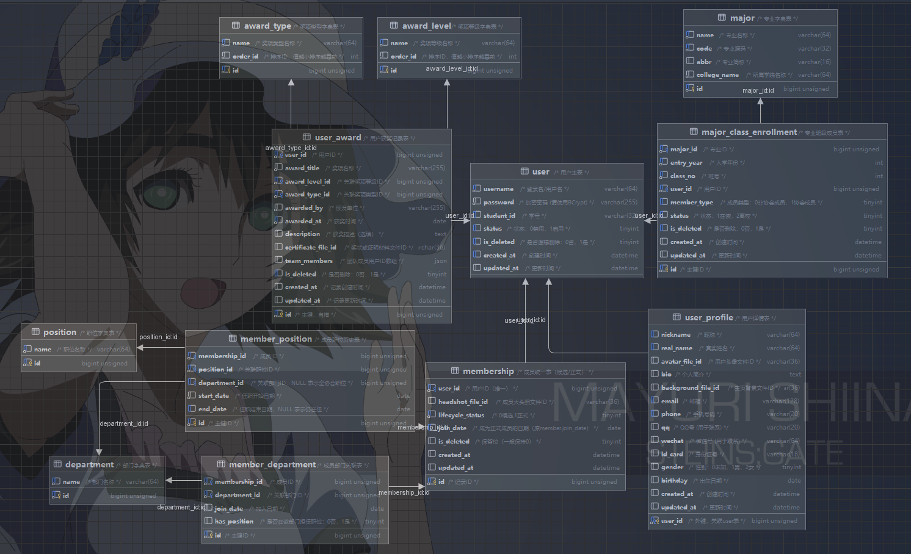

# User服务

## 服务概述

User服务负责管理用户、成员、获奖记录以及相关字典数据。服务基础路径：`/api/v1/user`

---

## 数据库设计

### 1. 字典表部分（5张）
1. **major** - 专业表
2. **award_type** - 奖项类型表
3. **award_level** - 奖项等级表
4. **department** - 部门表
5. **position** - 职位表

### 2. 关联表部分（4张）
1. **member_department** - 成员部门关联表
2. **member_position** - 成员职位管理关联表
3. **major_class_enrollment** - 专业班级关联表
4. **user_award** - 用户获奖记录关联表

### 3. 核心业务表（3张）
1. **user** - 用户表
2. **user_profile** - 用户详情表
3. **membership** - 成员表（合并了原member和member_candidate）

### 设计说明
- **user 表优化：** 将 `avatar_file_id` 从 `user_profile` 移至 `user` 表
  - 优势：查询用户基本信息时可直接获取头像，无需关联 user_profile 表
  - 适用场景：用户列表、评论展示等需要最小信息（ID、用户名、头像）的场景
- **user_award 表优化：** 移除了 `user_id` 字段，将所有获奖成员ID存储在 `team_members` JSON数组中
  - 个人获奖：`team_members` 只包含一个用户ID，如 `[1]`
  - 团队获奖：`team_members` 包含所有成员ID，如 `[1,2,3,5]`
  - 查询用户获奖：使用 `JSON_CONTAINS(team_members, 'userId')` 查询
  - 优势：避免数据冗余，一个奖项只存一条记录



---

## 接口设计

### 核心业务控制器

#### 一、用户控制器 (UserController)

**基础路径：** `/api/v1/user`

##### 1. 创建用户
- **接口：** `POST /api/v1/user`
- **描述：** 创建一个新用户（包含用户基本信息、详情信息和班级关联）
- **权限：** `USER_CREATE`
- **请求体：**
```json
{
  "username": "zhangsan",
  "password": "123456",
  "studentId": "2023010101",
  "status": 1,
  "realName": "张三",
  "nickname": "小张",
  "email": "zhangsan@example.com",
  "phone": "13800138000",
  "avatarFileId": "avatar-file-001",
  "bio": "个人简介",
  "gender": 1,
  "birthday": "2000-01-01",
  "idCard": "110101200001011234",
  "qq": "123456789",
  "wechat": "zhangsan_wx",
  "backgroundFileId": "bg-file-001",
  "majorId": 201,
  "entryYear": 2023,
  "classNo": 1,
  "memberType": 0
}
```
- **响应：**
```json
{
  "code": 200,
  "message": "success",
  "data": {
    "id": 1,
    "username": "zhangsan",
    "studentId": "2023010101",
    "nickname": "小张",
    "avatarFileId": "avatar-file-001",
    "createAt": "2023-09-01T10:00:00",
    "updateAt": "2023-09-01T10:00:00"
  }
}
```

##### 2. 更新用户信息
- **接口：** `PUT /api/v1/user/{id}`
- **描述：** 更新用户信息（支持更新基本信息和详细信息）
- **权限：** `USER_UPDATE` 或用户本人、管理员也可以
- **路径参数：** `id` - 用户ID
- **请求体：** （所有字段均为可选，只更新提供的字段）
```json
{
  "username": "zhangsan",
  "password": "newpassword",
  "studentId": "2023010101",
  "status": 1,
  "nickname": "新昵称",
  "realName": "张三",
  "email": "newemail@example.com",
  "phone": "13900139000",
  "avatarFileId": "new-avatar-001",
  "bio": "更新的个人简介",
  "backgroundFileId": "new-bg-001",
  "gender": 1,
  "birthday": "2000-01-01",
  "idCard": "110101200001011234",
  "qq": "987654321",
  "wechat": "new_wechat",
  "majorId": 201,
  "entryYear": 2023,
  "classNo": 1
}
```
- **响应：** 同创建用户响应

##### 3. 查询用户
- **接口：** `GET /api/v1/user`
- **描述：** 根据不同条件查询用户详细信息（支持按ID、用户名、学号查询）
- **权限：** `USER_VIEW`、所有已认证用户
- **查询参数：** （三选一，优先级：id > username > studentId）
  - `id` - 用户ID
  - `username` - 用户名
  - `studentId` - 学号
- **示例：**
  - `GET /api/v1/user?id=1`
  - `GET /api/v1/user?username=zhangsan`
  - `GET /api/v1/user?studentId=2023010101`
- **响应：** 同创建用户响应

##### 4. 检查学号是否存在
- **接口：** `GET /api/v1/user/check-student-id/{studentId}`
- **描述：** 验证学号是否已被使用
- **路径参数：** `studentId` - 学号
- **响应：**
```json
{
  "code": 200,
  "message": "success",
  "data": true
}
```

##### 5. 分页查询用户列表
- **接口：** `POST /api/v1/user/page`
- **描述：** 根据条件分页查询用户列表
- **权限：** `USER_LIST`、所有已认证用户
- **请求体：**
```json
{
  "pageNum": 1,
  "pageSize": 10,
  "params": {
    "username": "zhang",
    "realName": "张",
    "email": "example.com",
    "phone": "138",
    "status": 1
  },
  "keyword": "张三"
}
```
- **响应：**
```json
{
  "code": 200,
  "message": "success",
  "data": {
    "records": [...],
    "total": 100,
    "pageNum": 1,
    "pageSize": 10
  }
}
```

##### 6. 删除用户
- **接口：** `DELETE /api/v1/user/{id}`
- **描述：** 根据用户ID删除用户（逻辑删除）
- **权限：** `USER_DELETE`
- **路径参数：** `id` - 用户ID
- **响应：**
```json
{
  "code": 200,
  "message": "success",
  "data": true
}
```

---

#### 二、获奖控制器 (UserAwardController)

**基础路径：** `/api/v1/user/awards`

##### 1. 创建获奖记录
- **接口：** `POST /api/v1/user/awards`
- **描述：** 创建获奖记录（团队获奖只需创建一条记录）
- **请求体：**
- **权限：** `USER_AWARD_CREATE`、成员级别
```json
{
  "awardTitle": "全国大学生服务外包创新创业大赛",
  "awardLevelId": 501,
  "awardTypeId": 602,
  "awardedBy": "教育部",
  "awardedAt": "2024-05-20",
  "description": "获奖描述",
  "certificateFileId": "cert-file-001",
  "teamMembers": [1, 2, 3, 5]
}
```
- **说明：** `teamMembers` 数组包含所有获奖成员的用户ID（包括个人或团队所有成员）
- **响应：**
```json
{
  "code": 200,
  "message": "success",
  "data": {
    "id": 1,
    "awardTitle": "全国大学生服务外包创新创业大赛",
    "awardLevelId": 501,
    "awardTypeId": 602,
    "awardedBy": "教育部",
    "awardedAt": "2024-05-20",
    "teamMembers": "[1,2,3,5]",
    "createdAt": "2024-05-21T10:00:00"
  }
}
```

##### 2. 更新获奖记录
- **接口：** `PUT /api/v1/user/awards/{id}`
- **描述：** 更新获奖记录信息
- **路径参数：** `id` - 获奖记录ID
- **请求体：** 同创建获奖记录
- **响应：** 同创建获奖记录响应

##### 3. 查询获奖记录
- **接口：** `GET /api/v1/user/awards/{id}`
- **描述：** 根据ID查询获奖记录详情
- **路径参数：** `id` - 获奖记录ID
- **响应：** 同创建获奖记录响应

##### 4. 查询用户获奖列表
- **接口：** `GET /api/v1/user/awards/user/{userId}`
- **描述：** 查询指定用户的所有获奖记录（包括个人和团队获奖）
- **路径参数：** `userId` - 用户ID
- **说明：** 使用 `JSON_CONTAINS(team_members, 'userId')` 查询该用户参与的所有获奖
- **响应：**
```json
{
  "code": 200,
  "message": "success",
  "data": [
    {
      "id": 1,
      "awardTitle": "全国大学生服务外包创新创业大赛",
      "awardLevelId": 501,
      "awardTypeId": 602,
      "awardedBy": "教育部",
      "awardedAt": "2024-05-20",
      "teamMembers": "[1,2,3,5]",
      "createdAt": "2024-05-21T10:00:00"
    }
  ]
}
```

##### 5. 分页查询获奖记录
- **接口：** `POST /api/v1/user/awards/page`
- **描述：** 分页查询获奖记录
- **请求体：**
```json
{
  "pageNum": 1,
  "pageSize": 10,
  "params": {
    "userId": 1,
    "awardLevelId": 501,
    "awardTypeId": 602,
    "awardedAtStart": "2024-01-01",
    "awardedAtEnd": "2024-12-31"
  }
}
```
- **说明：** 如果提供 `userId`，会查询该用户参与的所有获奖（使用JSON_CONTAINS）
- **响应：**
```json
{
  "code": 200,
  "message": "success",
  "data": {
    "records": [...],
    "total": 50,
    "pageNum": 1,
    "pageSize": 10
  }
}
```

##### 6. 删除获奖记录
- **接口：** `DELETE /api/v1/user/awards/{id}`
- **描述：** 删除获奖记录（逻辑删除）
- **路径参数：** `id` - 获奖记录ID
- **响应：**
```json
{
  "code": 200,
  "message": "success",
  "data": true
}
```

---

#### 三、成员控制器 (MembershipController)

**基础路径：** `/api/v1/user/memberships`

> 注意：该控制器合并了原member和member_candidate的功能，通过lifecycleStatus区分候选(0)和正式(1)成员

##### 1. 申请成为候选成员
- **接口：** `POST /api/v1/user/memberships/apply`
- **描述：** 用户申请加入协会，创建候选成员记录
- **请求体：**
```json
{
  "userId": 1,
  "headshotFileId": "headshot-file-001"
}
```
- **响应：**
```json
{
  "code": 200,
  "message": "success",
  "data": 1
}
```

##### 2. 候选成员转正
- **接口：** `PUT /api/v1/user/memberships/{id}/promote`
- **描述：** 管理员审核通过，将候选成员转为正式成员
- **路径参数：** `id` - 成员ID
- **请求体：**
```json
{
  "joinDate": "2024-09-01",
  "headshotFileId": "new-headshot-file-001"
}
```
- **响应：**
```json
{
  "code": 200,
  "message": "success",
  "data": true
}
```

##### 3. 更新成员信息
- **接口：** `PUT /api/v1/user/memberships/{id}`
- **描述：** 更新成员的基本信息
- **路径参数：** `id` - 成员ID
- **请求体：**
```json
{
  "headshotFileId": "updated-headshot-file-001"
}
```
- **响应：**
```json
{
  "code": 200,
  "message": "success",
  "data": true
}
```

##### 4. 删除成员
- **接口：** `DELETE /api/v1/user/memberships/{id}`
- **描述：** 逻辑删除成员记录
- **路径参数：** `id` - 成员ID
- **响应：**
```json
{
  "code": 200,
  "message": "success",
  "data": true
}
```

##### 5. 查询成员信息
- **接口：** `GET /api/v1/user/memberships/{id}`
- **描述：** 根据成员ID查询成员基本信息
- **路径参数：** `id` - 成员ID
- **响应：**
```json
{
  "code": 200,
  "message": "success",
  "data": {
    "id": 1,
    "userId": 1,
    "headshotFileId": "headshot-file-001",
    "lifecycleStatus": 1,
    "lifecycleStatusName": "正式成员",
    "joinDate": "2024-09-01",
    "createdAt": "2024-08-01T10:00:00",
    "updatedAt": "2024-09-01T10:00:00"
  }
}
```

##### 6. 根据用户ID查询成员
- **接口：** `GET /api/v1/user/memberships/by-user/{userId}`
- **描述：** 根据用户ID查询成员信息
- **路径参数：** `userId` - 用户ID
- **响应：** 同查询成员信息响应

##### 7. 查询成员详情
- **接口：** `GET /api/v1/user/memberships/{id}/detail`
- **描述：** 查询成员详细信息（含用户、部门、职位）
- **路径参数：** `id` - 成员ID
- **响应：**
```json
{
  "code": 200,
  "message": "success",
  "data": {
    "id": 1,
    "userId": 1,
    "username": "zhangsan",
    "studentId": "2023010101",
    "realName": "张三",
    "nickname": "小张",
    "avatarFileId": "avatar-file-001",
    "headshotFileId": "headshot-file-001",
    "email": "zhangsan@example.com",
    "phone": "13800138000",
    "lifecycleStatus": 1,
    "lifecycleStatusName": "正式成员",
    "joinDate": "2024-09-01",
    "departments": [
      {
        "departmentId": 301,
        "departmentName": "JAVA部",
        "joinDate": "2024-09-01",
        "hasPosition": true
      }
    ],
    "positions": [
      {
        "positionId": 401,
        "positionName": "JAVA部部长",
        "departmentId": 301,
        "departmentName": "JAVA部",
        "startDate": "2024-09-01",
        "endDate": null
      }
    ],
    "createdAt": "2024-08-01T10:00:00",
    "updatedAt": "2024-09-01T10:00:00"
  }
}
```

##### 8. 查询候选成员列表（简单列表）
- **接口：** `GET /api/v1/user/memberships/candidates`
- **描述：** 查询所有候选成员（不分页，适用于数据量较小的场景，如下拉选择）
- **说明：** 如需分页查询，请使用接口11，设置 `lifecycleStatus=0`
- **响应：**
```json
{
  "code": 200,
  "message": "success",
  "data": [
    {
      "id": 1,
      "userId": 8,
      "headshotFileId": null,
      "lifecycleStatus": 0,
      "lifecycleStatusName": "候选成员",
      "joinDate": null
    }
  ]
}
```

##### 9. 查询正式成员列表（简单列表）
- **接口：** `GET /api/v1/user/memberships/officials`
- **描述：** 查询所有正式成员（不分页，适用于数据量较小的场景，如下拉选择）
- **说明：** 如需分页查询，请使用接口11，设置 `lifecycleStatus=1`
- **响应：**
```json
{
  "code": 200,
  "message": "success",
  "data": [
    {
      "id": 1,
      "userId": 1,
      "headshotFileId": "headshot-file-001",
      "lifecycleStatus": 1,
      "lifecycleStatusName": "正式成员",
      "joinDate": "2024-09-01"
    }
  ]
}
```

##### 10. 条件查询成员（简单列表）
- **接口：** `GET /api/v1/user/memberships`
- **描述：** 根据条件查询成员列表（不分页，适用于特定条件筛选后数据量较小的场景）
- **说明：** 如需分页查询，请使用接口11
- **查询参数：**
  - `lifecycleStatus` - 生命周期状态（0候选，1正式，null查询所有）
  - `userId` - 用户ID
  - `departmentId` - 部门ID
  - `positionId` - 职位ID
  - `joinDateStart` - 加入日期开始
  - `joinDateEnd` - 加入日期结束
  - `username` - 用户名（模糊查询）
  - `realName` - 真实姓名（模糊查询）
  - `studentId` - 学号
- **响应：**
```json
{
  "code": 200,
  "message": "success",
  "data": [
    {
      "id": 1,
      "userId": 1,
      "username": "zhangsan",
      "realName": "张三",
      "lifecycleStatus": 1,
      "joinDate": "2024-09-01"
    }
  ]
}
```

##### 11. 分页查询成员
- **接口：** `POST /api/v1/user/memberships/page`
- **描述：** 分页查询成员列表
- **请求体：**
```json
{
  "pageNum": 1,
  "pageSize": 10,
  "params": {
    "lifecycleStatus": 1,
    "userId": null,
    "departmentId": null,
    "positionId": null,
    "joinDateStart": "2024-01-01",
    "joinDateEnd": "2024-12-31",
    "username": "zhang",
    "realName": "张",
    "studentId": "2023"
  }
}
```
- **响应：**
```json
{
  "code": 200,
  "message": "success",
  "data": {
    "records": [...],
    "total": 100,
    "pageNum": 1,
    "pageSize": 10
  }
}
```

##### 12. 检查用户成员身份
- **接口：** `GET /api/v1/user/memberships/check/{userId}`
- **描述：** 判断用户是否为成员（候选或正式）
- **路径参数：** `userId` - 用户ID
- **响应：**
```json
{
  "code": 200,
  "message": "success",
  "data": true
}
```

##### 13. 检查是否为候选成员
- **接口：** `GET /api/v1/user/memberships/check/{userId}/candidate`
- **描述：** 判断用户是否为候选成员
- **路径参数：** `userId` - 用户ID
- **响应：**
```json
{
  "code": 200,
  "message": "success",
  "data": false
}
```

##### 14. 检查是否为正式成员
- **接口：** `GET /api/v1/user/memberships/check/{userId}/official`
- **描述：** 判断用户是否为正式成员
- **路径参数：** `userId` - 用户ID
- **响应：**
```json
{
  "code": 200,
  "message": "success",
  "data": true
}
```

---

### 字典业务控制器

> 字典业务控制器，用于字典表的增删改查

#### 一、专业控制器 (MajorController)

**基础路径：** `/api/v1/user/majors`

##### 1. 创建专业
- **接口：** `POST /api/v1/user/majors`
- **请求体：**
```json
{
  "name": "软件技术",
  "code": "SE",
  "abbr": "软件",
  "collegeName": "信息工程学院"
}
```
- **响应：**
```json
{
  "code": 200,
  "message": "success",
  "data": {
    "id": 201,
    "name": "软件技术",
    "code": "SE",
    "abbr": "软件",
    "collegeName": "信息工程学院"
  }
}
```

##### 2. 更新专业
- **接口：** `PUT /api/v1/user/majors/{id}`
- **路径参数：** `id` - 专业ID
- **请求体：** 同创建专业
- **响应：** 同创建专业响应

##### 3. 查询专业
- **接口：** `GET /api/v1/user/majors/{id}`
- **路径参数：** `id` - 专业ID
- **响应：** 同创建专业响应

##### 4. 查询专业列表（字典数据）
- **接口：** `GET /api/v1/user/majors`
- **描述：** 查询所有专业（不分页，字典数据通常数量较少）
- **响应：**
```json
{
  "code": 200,
  "message": "success",
  "data": [
    {
      "id": 201,
      "name": "软件技术",
      "code": "SE",
      "abbr": "软件",
      "collegeName": "信息工程学院"
    }
  ]
}
```

##### 5. 删除专业
- **接口：** `DELETE /api/v1/user/majors/{id}`
- **路径参数：** `id` - 专业ID
- **响应：**
```json
{
  "code": 200,
  "message": "success",
  "data": true
}
```

---

#### 二、奖项类型和等级控制器

**基础路径：** `/api/v1/user/award-levels` 和 `/api/v1/user/award-types`

##### 奖项等级 (AwardLevelController)

**基础路径：** `/api/v1/user/award-levels`

1. **创建奖项等级** - `POST /api/v1/user/award-levels`
   - **请求体：**
   ```json
   {
     "name": "国家级",
     "orderId": 1
   }
   ```

2. **更新奖项等级** - `PUT /api/v1/user/award-levels/{id}`
3. **查询奖项等级** - `GET /api/v1/user/award-levels/{id}`
4. **查询奖项等级列表（字典数据）** - `GET /api/v1/user/award-levels`
   - 不分页，按 `orderId` 排序
5. **删除奖项等级** - `DELETE /api/v1/user/award-levels/{id}`

##### 奖项类型 (AwardTypeController)

**基础路径：** `/api/v1/user/award-types`

1. **创建奖项类型** - `POST /api/v1/user/award-types`
   - **请求体：**
   ```json
   {
     "name": "学科竞赛",
     "orderId": 1
   }
   ```

2. **更新奖项类型** - `PUT /api/v1/user/award-types/{id}`
3. **查询奖项类型** - `GET /api/v1/user/award-types/{id}`
4. **查询奖项类型列表（字典数据）** - `GET /api/v1/user/award-types`
   - 不分页，按 `orderId` 排序
5. **删除奖项类型** - `DELETE /api/v1/user/award-types/{id}`

---

#### 三、部门控制器 (DepartmentController)

**基础路径：** `/api/v1/user/departments`

##### 1. 创建部门
- **接口：** `POST /api/v1/user/departments`
- **请求体：**
```json
{
  "name": "JAVA部",
  "orderId": 1
}
```

##### 2. 更新部门
- **接口：** `PUT /api/v1/user/departments/{id}`

##### 3. 查询部门
- **接口：** `GET /api/v1/user/departments/{id}`

##### 4. 查询部门列表（字典数据）
- **接口：** `GET /api/v1/user/departments`
- **描述：** 查询所有部门（不分页，按 `orderId` 排序）

##### 5. 删除部门
- **接口：** `DELETE /api/v1/user/departments/{id}`

---

#### 四、职位控制器 (PositionController)

**基础路径：** `/api/v1/user/positions`

##### 1. 创建职位
- **接口：** `POST /api/v1/user/positions`
- **请求体：**
```json
{
  "name": "JAVA部部长",
  "orderId": 1
}
```

##### 2. 更新职位
- **接口：** `PUT /api/v1/user/positions/{id}`

##### 3. 查询职位
- **接口：** `GET /api/v1/user/positions/{id}`

##### 4. 查询职位列表（字典数据）
- **接口：** `GET /api/v1/user/positions`
- **描述：** 查询所有职位（不分页，按 `orderId` 排序）

##### 5. 删除职位
- **接口：** `DELETE /api/v1/user/positions/{id}`

---

### 供服务调用的控制器

#### 一、用户Feign控制器 (UserFeignController)

**基础路径：** `/api/v1/user/feign`

> 专门用于内部服务间调用的接口，包含注册、登录等认证相关功能

##### 1. 用户注册（基础信息）
- **接口：** `POST /api/v1/user/feign/register`
- **描述：** 用户注册接口，只需填写基础必要信息，供认证服务调用
- **权限：** 内部服务调用（无需Token）
- **请求体：**
```json
{
  "username": "zhangsan",
  "password": "123456",
  "studentId": "2023010101",
  "realName": "张三"
}
```
- **响应：**
```json
{
  "code": 200,
  "message": "注册成功",
  "data": {
    "id": 1,
    "username": "zhangsan",
    "studentId": "2023010101",
    "status": 1,
    "createAt": "2023-09-01T10:00:00"
  }
}
```

##### 2. 根据用户名查询用户（含密码）
- **接口：** `GET /api/v1/user/feign/username/{username}`
- **描述：** 供认证服务调用，返回包含密码的完整用户信息（用于登录验证）
- **权限：** 内部服务调用（无需Token）
- **路径参数：** `username` - 用户名
- **响应：**
```json
{
  "code": 200,
  "message": "success",
  "data": {
    "id": 1,
    "username": "zhangsan",
    "password": "$2a$10$...",
    "studentId": "2023010101",
    "status": 1
  }
}
```

##### 3. 检查用户名是否存在
- **接口：** `GET /api/v1/user/feign/check-username/{username}`
- **描述：** 验证用户名是否已被使用（注册时调用）
- **权限：** 内部服务调用（无需Token）
- **路径参数：** `username` - 用户名
- **响应：**
```json
{
  "code": 200,
  "message": "success",
  "data": true
}
```

##### 4. 检查学号是否存在
- **接口：** `GET /api/v1/user/feign/check-student-id/{studentId}`
- **描述：** 验证学号是否已被使用（注册时调用）
- **权限：** 内部服务调用（无需Token）
- **路径参数：** `studentId` - 学号
- **响应：**
```json
{
  "code": 200,
  "message": "success",
  "data": false
}
```

---

## 废弃接口说明

以下接口已标记为废弃，建议使用新接口：

### 废弃的成员接口
- `/api/v1/user/members/*` - 正式成员接口（已废弃）
- `/api/v1/user/candidates/*` - 候选成员接口（已废弃）

**替代方案：** 使用 `/api/v1/user/api/memberships/*` 统一成员接口

---

## 数据模型说明

### 生命周期状态 (lifecycleStatus)
- `0` - 候选成员
- `1` - 正式成员

### 成员类型 (memberType)
- `0` - 非协会成员
- `1` - 协会成员

### 班级用户状态 (status)
- `1` - 在读
- `2` - 离校

### 用户状态 (status)
- `0` - 禁用
- `1` - 启用

---

## 错误码说明

| 错误码 | 说明 |
|--------|------|
| 200 | 成功 |
| 400 | 请求参数错误 |
| 401 | 未授权 |
| 403 | 无权限 |
| 404 | 资源不存在 |
| 500 | 服务器内部错误 |

---

## 更新日志

### v5.0 (2025-11-09)
- ✅ 合并 member 和 member_candidate 为 membership 表
- ✅ 重命名 user_position 为 member_position
- ✅ 简化 major_class_enrollment 的枚举值
- ✅ user 表添加 student_id 字段
- ✅ 新增 MembershipController 统一管理成员
- ✅ 废弃旧的 MemberController 和 MemberCandidateController
- ✅ 优化 user_award 表设计：移除 user_id 字段，使用 team_members JSON数组存储所有获奖成员
- ✅ 更新 certificateUrl 为 certificateFileId
- ✅ 完善获奖记录接口文档，支持团队获奖和个人获奖统一管理
- ✅ 将 avatar_file_id 从 user_profile 移至 user 表，方便最小信息展示

---

## 用户注册流程说明

### 标准注册流程（推荐）

1. **注册阶段** - 用户填写基础信息
   - 前端调用认证服务的注册接口
   - 认证服务通过Feign调用 `POST /api/v1/user/feign/register`
   - 只需提供：用户名、密码、学号、真实姓名
   - 注册成功后可直接登录

2. **完善信息阶段** - 用户登录后完善详细信息
   - 用户登录系统获取Token
   - 调用 `PUT /api/v1/user/{id}` 接口更新详细信息
   - 填写：昵称、头像、邮箱、电话、个人简介等
   - 可选择加入班级（专业、入学年份、班号）

3. **后续更新** - 随时更新个人信息
   - 调用 `PUT /api/v1/user/{id}` 接口
   - 更新任意详细信息字段

### 管理员创建用户流程

- 管理员可使用 `POST /api/v1/user` 接口一次性创建完整用户信息

---

## 通用数据结构说明

### 分页请求 (PageDTO)
```json
{
  "pageNum": 1,           // 页码，从1开始，必填
  "pageSize": 10,         // 每页条数，必填
  "params": {},           // 查询条件对象，可选
  "keyword": ""           // 关键字搜索，可选
}
```

### 分页响应 (PageVO)
```json
{
  "total": 100,           // 总条数
  "pageNum": 1,           // 当前页
  "pageSize": 10,         // 每页条数
  "records": []           // 当前页数据列表
}
```

### 统一响应 (Result)
```json
{
  "code": 200,            // 状态码
  "message": "success",   // 消息
  "data": {}              // 数据
}
```

---

## 接口设计原则

### 分页 vs 列表查询

本服务接口遵循以下设计原则：

1. **字典数据（不分页）**
   - 专业、部门、职位、奖项等级、奖项类型等字典表
   - 特点：数据量小（通常 < 100条），变化频率低
   - 接口：`GET /api/v1/user/{resource}` 返回完整列表
   - 用途：下拉选择、前端缓存

2. **业务数据（必须分页）**
   - 用户、获奖记录等核心业务数据
   - 特点：数据量大，持续增长
   - 接口：`POST /api/v1/user/{resource}/page` 返回分页数据
   - 用途：列表展示、数据管理

3. **特殊场景（简单列表）**
   - 候选成员列表、正式成员列表等
   - 特点：特定条件筛选后数据量可控
   - 接口：`GET /api/v1/user/{resource}` 返回简单列表
   - 说明：如数据量增长，建议改用分页接口

---

## 注意事项

1. **Feign接口** (`/feign/*`) 仅供内部服务调用，不对外暴露
2. 用户注册和登录通过认证服务统一处理，认证服务再调用User服务的Feign接口
3. 用户名和学号具有唯一性，注册前建议先调用检查接口验证
4. 密码会在后端使用 BCrypt 加密存储，前端传输时建议使用 HTTPS
5. 所有需要权限的接口都需要在请求头中携带有效的 JWT Token
6. **分页参数：** 使用 `pageNum`（页码）和 `pageSize`（每页条数），默认每页10条
7. **分页查询：** 查询条件放在 `params` 对象中，支持 `keyword` 关键字搜索
8. 日期格式统一使用 ISO 8601 格式：`yyyy-MM-dd` 或 `yyyy-MM-ddTHH:mm:ss`
9. 文件ID字段（如avatarFileId）需要先通过文件服务上传获取
10. 候选成员转正操作不可逆，请谨慎操作
11. 用户可以先注册后完善信息，头像等非必填字段可以后续补充
12. **获奖记录设计：** 团队获奖只需创建一条记录，所有成员ID存储在 `teamMembers` 数组中，避免数据冗余
13. **查询用户获奖：** 使用 `JSON_CONTAINS(team_members, 'userId')` 可以高效查询用户参与的所有获奖（包括个人和团队）
14. **头像字段优化：** `avatarFileId` 存储在 `user` 表中，查询用户基本信息时无需关联 `user_profile` 表
