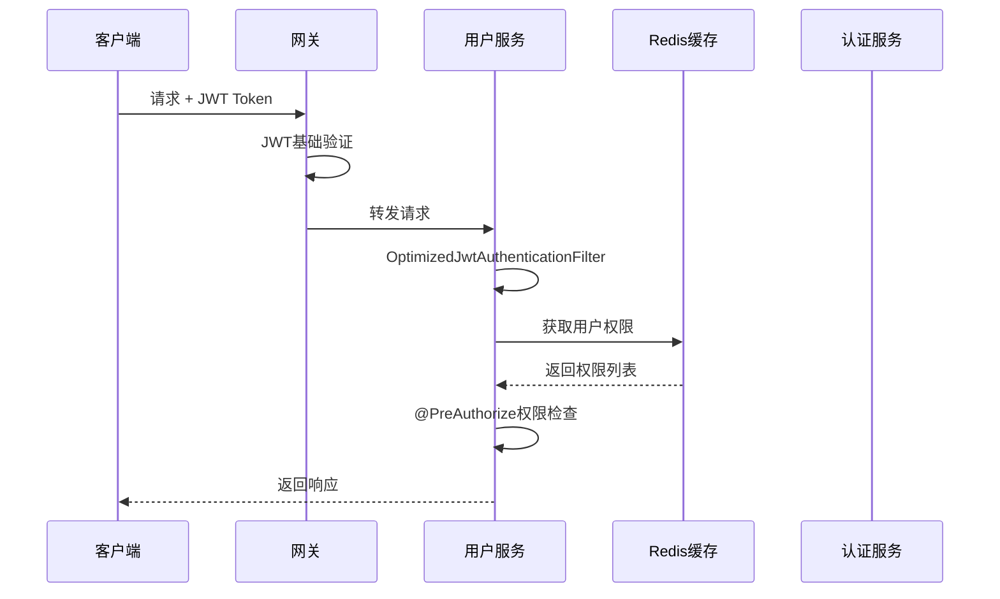

基于项目代码分析，我将详细解释SIAE项目中Redis权限缓存服务的完整工作机制：

## 1. Redis权限缓存服务的架构设计

### 核心组件架构

````java path=siae-common/src/main/java/com/hngy/siae/common/service/RedisPermissionService.java mode=EXCERPT
/**
 * Redis权限服务接口
 * 提供统一的权限查询接口，支持优雅降级
 */
public interface RedisPermissionService {
    List<String> getUserPermissions(Long userId);
    List<String> getUserRoles(Long userId);
    List<String> getAllUserAuthorities(Long userId);
}
````

### 权限数据存储结构

权限数据在Redis中的存储采用以下key命名规范：

````java path=services/siae-auth/src/main/java/com/hngy/siae/auth/service/impl/RedisPermissionCacheServiceImpl.java mode=EXCERPT
// Redis key前缀定义
private static final String PERMISSION_KEY_PREFIX = "auth:perms:";  // 用户权限
private static final String ROLE_KEY_PREFIX = "auth:roles:";        // 用户角色
private static final String DELIMITER = ",";                       // 分隔符

// 存储结构示例：
// auth:perms:1 -> "system:user:query,system:user:add,content:article:view"
// auth:roles:1 -> "ADMIN,USER"
````

### 服务职责分工

1. **RedisPermissionCacheService**（认证服务专用）：
    - 负责权限数据的缓存和管理
    - 提供缓存的CRUD操作
    - 处理缓存过期和清理

2. **RedisPermissionService**（通用接口）：
    - 为所有服务提供统一的权限查询接口
    - 支持优雅降级机制
    - 屏蔽底层Redis实现细节

## 2. 跨服务权限验证机制

### JWT Token结构优化

经过优化后的JWT token结构：

````markdown path=JWT_OPTIMIZATION_GUIDE.md mode=EXCERPT
### 优化后的优势
- **Token大小减少**: JWT只包含基本信息（userId, username, exp）
- **实时权限更新**: 权限信息存储在Redis中，可以实时更新
- **高性能**: Redis缓存提供毫秒级权限查询
````

### 权限验证过滤器部署

`OptimizedJwtAuthenticationFilter`通过`siae-common`模块自动部署到所有服务：

````java path=siae-common/src/main/java/com/hngy/siae/common/filter/OptimizedJwtAuthenticationFilter.java mode=EXCERPT
@Component
@ConditionalOnClass(name = "org.springframework.data.redis.core.StringRedisTemplate")
public class OptimizedJwtAuthenticationFilter extends OncePerRequestFilter {
    
    @Override
    protected void doFilterInternal(HttpServletRequest request, HttpServletResponse response, 
            FilterChain filterChain) throws ServletException, IOException {
        
        // 1. 从JWT中提取基本用户信息
        Long userId = jwtUtils.getUserIdFromToken(token);
        String username = jwtUtils.getUsernameFromToken(token);
        
        // 2. 从Redis缓存中获取用户权限
        List<String> authorities = getUserAuthoritiesFromCache(userId);
        
        // 3. 构建Spring Security认证对象
        UsernamePasswordAuthenticationToken authentication = 
            new UsernamePasswordAuthenticationToken(username, null, grantedAuthorities);
        
        SecurityContextHolder.getContext().setAuthentication(authentication);
    }
}
````

## 3. 服务间权限传递流程

### 完整权限验证流程



### Feign服务间调用权限传递

````java path=services/siae-auth/src/main/java/com/hngy/siae/auth/filter/ServiceCallFeignInterceptor.java mode=EXCERPT
/**
 * Feign服务间调用拦截器
 * 自动为服务间调用添加认证token
 */
@Component
public class ServiceCallFeignInterceptor implements RequestInterceptor {
    
    @Override
    public void apply(RequestTemplate template) {
        // 生成服务间调用专用token
        String serviceCallToken = jwtUtils.createServiceCallToken();
        template.header(HttpHeaders.AUTHORIZATION, "Bearer " + serviceCallToken);
    }
}
````

### 自动权限过滤器配置

各个服务无需单独配置，通过`siae-common`模块自动处理：

````java path=siae-common/src/main/java/com/hngy/siae/common/config/SecurityAutoConfiguration.java mode=EDIT
@Configuration
@ConditionalOnClass(SecurityFilterChain.class)
public class SecurityAutoConfiguration {
    
    @Bean
    @ConditionalOnMissingBean
    public SecurityFilterChain filterChain(HttpSecurity http) throws Exception {
        return http
            .addFilterBefore(optimizedJwtAuthenticationFilter, 
                           UsernamePasswordAuthenticationFilter.class)
            .build();
    }
}
````

## 4. 开发使用指南

### @PreAuthorize注解的工作机制

当使用`@PreAuthorize`注解时，权限验证流程如下：

````java path=services/siae-user/src/main/java/com/hngy/siae/user/controller/UserController.java mode=EXCERPT
@GetMapping("/{id}")
@PreAuthorize("hasAuthority('" + USER_VIEW + "')")
public Result<UserVO> getUserById(@PathVariable Long id) {
    // 1. OptimizedJwtAuthenticationFilter已经从Redis加载了用户权限
    // 2. Spring Security自动检查当前用户是否拥有USER_VIEW权限
    // 3. 权限验证通过后才会执行业务逻辑
    return Result.success(userService.getUserById(id));
}
````

### 新服务权限控制配置

为新服务添加权限控制只需要：

1. **添加依赖**：引入`siae-common`模块
2. **配置Redis**：确保Redis连接配置正确
3. **使用注解**：在Controller方法上使用`@PreAuthorize`

````xml path=services/siae-new-service/pom.xml mode=EDIT
<dependencies>
    <!-- 引入公共模块，自动获得权限验证能力 -->
    <dependency>
        <groupId>com.hngy.siae</groupId>
        <artifactId>siae-common</artifactId>
        <version>${project.version}</version>
    </dependency>
</dependencies>
````

### 权限码定义规范

````java path=siae-core/src/main/java/com/hngy/siae/core/permissions/UserPermissions.java mode=EDIT
/**
 * 用户权限常量定义
 */
public class UserPermissions {
    public static final String USER_CREATE = "system:user:add";
    public static final String USER_UPDATE = "system:user:edit";
    public static final String USER_DELETE = "system:user:delete";
    public static final String USER_VIEW = "system:user:query";
    public static final String USER_LIST = "system:user:list";
}
````

## 5. 故障处理机制

### Redis不可用时的优雅降级

````java path=siae-common/src/main/java/com/hngy/siae/common/service/impl/FallbackPermissionServiceImpl.java mode=EXCERPT
/**
 * 权限服务的回退实现
 * 当Redis不可用时使用此实现，返回空权限列表
 */
@Service
@ConditionalOnMissingClass("org.springframework.data.redis.core.StringRedisTemplate")
public class FallbackPermissionServiceImpl implements RedisPermissionService {
    
    @Override
    public List<String> getAllUserAuthorities(Long userId) {
        log.warn("Redis不可用，返回空权限列表，用户ID: {}", userId);
        return Collections.emptyList();
    }
}
````

### 权限缓存异常处理

````java path=siae-common/src/main/java/com/hngy/siae/common/filter/OptimizedJwtAuthenticationFilter.java mode=EXCERPT
private List<String> getUserAuthoritiesFromCache(Long userId) {
    try {
        List<String> authorities = redisPermissionService.getAllUserAuthorities(userId);
        if (authorities.isEmpty()) {
            log.warn("用户权限缓存为空，用户ID: {}，可能需要重新登录", userId);
        }
        return authorities;
    } catch (Exception e) {
        log.error("从Redis获取用户权限失败，用户ID: {}，将使用空权限列表", userId, e);
        // Redis连接失败时，返回空权限列表而不是阻止用户访问
        return Collections.emptyList();
    }
}
````

## 权限验证工作原理总结

### 核心工作流程

1. **用户登录**：认证服务生成简化JWT，权限信息存储到Redis
2. **请求处理**：`OptimizedJwtAuthenticationFilter`从JWT提取用户信息，从Redis获取权限
3. **权限检查**：Spring Security根据`@PreAuthorize`注解进行权限验证
4. **服务调用**：Feign拦截器自动添加服务间调用token
5. **故障降级**：Redis不可用时自动切换到fallback实现

### 关键优势

- **性能优化**：JWT token大小减少，权限查询毫秒级响应
- **实时更新**：权限变更无需重新登录即可生效
- **自动化**：新服务只需引入公共模块即可获得完整权限验证能力
- **高可用**：Redis故障时系统仍可正常运行（降级模式）

这种设计实现了权限管理的集中化、自动化和高可用性，大大简化了微服务架构中的权限控制复杂度。
